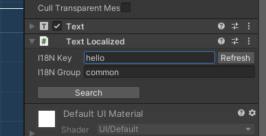

# TinaX Framework - Internationalization (I18N).


[-blue.svg)](https://github.com/996icu/996.ICU/blob/master/LICENSE)
<a href="https://996.icu"></a>
[](https://github.com/yomunsam/TinaX/blob/master/LICENSE)

<!-- [](https://github.com/yomunsam/TinaX/blob/master/LICENSE) -->

TinaX is a Unity-based framework, simple , complete and delightful, ready to use. TinaX provides functionality in the form of "Unity packages". 

`TinaX.I18N` provides internationalization feature support for TinaX Framework

- Use json (or `.asset` file) key/value to define the i18n table
- Real-time regions switching
- Extensions for UGUI.


<br>

package name: `io.nekonya.tinax.i18n`

<br>

"Readme" in other languages :

- [简体中文](README_CN.md)

<br>

------

## QuickStart

The main service interface of VFS:

``` csharp
TinaX.I18N.II18N
```
Facade of the main service interface:

``` csharp
TinaX.I18N.XI18N
```

<br>

Define some json file: 

**en_common.json**

``` json 
{
    "data":[
        { "k": "hello", "v" : "Hello"   },
        { "k": "meow",  "v" : "Meow~"   }
    ]
}
```

**jp_common.json**

``` json 
{
    "data":[
        { "k": "hello",   "v" : "こんいちは"},
        { "k": "meow" ,   "v" : "にゃ"     }
    ]
}
```


> The Json file is suitable for slightly larger projects. Usually in these projects, the I18N definition file will be configured by Excel and exported to Json through the tools in the team.
>
> For small-scale projects, Json seems too cumbersome, it is recommended to directly use the form of `.asset` file to configure the data.

Then configure the above json file in the corresponding area in the "Project Settings" window.

<br>

Use I18N text in code.

``` csharp
gameObject.GetComponent<Text>().text = i18n.GetText("hello");
//The object "i18n" (type: II18N) can be obtained through dependency injection. or use facade.
```

For scenes that do not require coding, you can also use Component to set Text directly.



> Most functions of TinaX are based on URI to management assets, such as pictures, audio, Prefabs, etc. This means that almost all functions can provide localized services through the i18n system in the form of key/value table.

For other usages, please read the [documentation](https://tinax.corala.space).

<br>

------

## Install this package

### Install via [openupm](https://openupm.com/)

``` bash
# Install openupm-cli if not installed.
npm install -g openupm-cli
# OR yarn global add openupm-cli

#run install in your project root folder
openupm add io.nekonya.tinax.i18n
```

<br>

### Install via npm (UPM)

Modify `Packages/manifest.json` file in your project, and add the following code before "dependencies" node of this file:

``` json
"scopedRegistries": [
    {
        "name": "TinaX",
        "url": "https://registry.npmjs.org",
        "scopes": [
            "io.nekonya"
        ]
    },
    {
        "name": "package.openupm.com",
        "url": "https://package.openupm.com",
        "scopes": [
            "com.cysharp.unitask",
            "com.neuecc.unirx"
        ]
    }
],
```

If after doing the above, you still cannot find the relevant Packages for TinaX in the "Unity Package Manager" window, You can also try refreshing, restarting the editor, or manually adding the following configuration to "dependencies" node.

``` json
"io.nekonya.tinax.i18n" : "6.6.1"
```

<br>

### Install via git UPM:

You can use the following to install and use this package in UPM GUI.  

```
git://github.com/yomunsam/TinaX.I18N.git
```

If you want to set a target version, you can use release tag like `#6.6.3`. for detail you can see this page: [https://github.com/yomunsam/TinaX.I18N/releases](https://github.com/yomunsam/TinaX.I18N/releases)


<br><br>
------

## Dependencies

- [com.neuecc.unirx](https://github.com/neuecc/UniRx#upm-package) :`https://github.com/neuecc/UniRx.git?path=Assets/Plugins/UniRx/Scripts`
- [io.nekonya.tinax.core](https://github.com/yomunsam/tinax.core) :`git://github.com/yomunsam/TinaX.Core.git`

> if you install packages by git UPM， You need to install the dependencies manually. Or dependencies will installed automatically by NPM / OpenUPM

<br><br>

------

## Learn TinaX

You can find out how to use the various features of TinaX in the [documentation](https://tinax.corala.space)

------

## Third-Party

The following excellent third-party libraries are used in this project:

- **[UniRx](https://github.com/neuecc/UniRx)** : Reactive Extensions for Unity