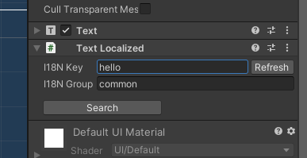

# TinaX Framework - 国际化（I18N）.


[-blue.svg)](https://github.com/996icu/996.ICU/blob/master/LICENSE)
<a href="https://996.icu"></a>
[](https://github.com/yomunsam/TinaX/blob/master/LICENSE)

<!-- [](https://github.com/yomunsam/TinaX/blob/master/LICENSE) -->

TinaX是一个简洁、完整、愉快的开箱即用的Unity应用游戏开发框架， 它采用"Unity 包"的形式提供功能。

`TinaX.I18N` 为TinaX Framework提供了国际化相关功能.

- 使用Json （或`.asset`文件）定义的key/value配表
- 实时的区域切换
- 针对UGUI的扩展

<br>

package name: `io.nekonya.tinax.i18n`

<br>

------

## QuickStart

VFS的主要服务接口：

``` csharp
TinaX.I18N.II18N
```
主要服务接口的Facade

``` csharp
TinaX.I18N.XI18N
```

<br>

定义一些Json文件

**en_common.json**

``` json 
{
    "data":[
        { "k": "hello", "v" : "Hello"   },
        { "k": "meow",  "v" : "Meow~"   }
    ]
}
```

**jp_common.json**

``` json 
{
    "data":[
        { "k": "hello",   "v" : "こんいちは"},
        { "k": "meow" ,   "v" : "にゃ"     }
    ]
}
```


> Json文件适用于规模稍大的项目，通常在这些项目中，I18N定义文件会在Excel中由专人配置，并通过团队内的工具导出到Json.
>
> 对于规模较小的项目，Json显得过于繁琐，推荐直接使用`.asset`文件的形式来配置数据.

然后在“Project Settings”窗口中，将上述Json文件配置给对应的区域。

<br>

在代码中使用I18N文本

``` csharp
gameObject.GetComponent<Text>().text = i18n.GetText("hello");
//对象 "i18n" (type: II18N) 可通过依赖注入获得, 或者可使用facade.
```

对于不必在代码中配置的内容，我们也可以直接使用对应的组件提供本地化显示。



> TinaX的大部分功能都是基于路径管理资产的，包括图片、音频、Prefab等，这也就意味着几乎所有功能都可以通过key/value形式的i18n系统来提供本地化服务。

更多用法请 [查看文档](https://tinax.corala.space).

<br>

------

## 安装

### 使用[OpenUPM](https://openupm.com/)安装

``` bash
# Install openupm-cli if not installed.
npm install -g openupm-cli
# OR yarn global add openupm-cli

#run install in your project root folder
openupm add io.nekonya.tinax.i18n
```

<br>

### 通过npm安装 (UPM)

修改您的工程中的`Packages/manifest.json` 文件，并在文件的"dependencies"节点前添加如下内容：

``` json
"scopedRegistries": [
    {
        "name": "TinaX",
        "url": "https://registry.npmjs.org",
        "scopes": [
            "io.nekonya"
        ]
    },
    {
        "name": "package.openupm.com",
        "url": "https://package.openupm.com",
        "scopes": [
            "com.cysharp.unitask",
            "com.neuecc.unirx"
        ]
    }
],
```

如果在进行上述操作后，您仍然未能在"Unity Package Manager"窗口中找到TinaX的相关Packages，您也可以尝试刷新、重启编辑器，或手动添加如下配置到"dependencies":

``` json
"io.nekonya.tinax.i18n" : "6.6.1"
```

<br>

### 通过Git方式安装(UPM)

你可使用如下地址在Unity Package Manager窗口中安装本包： 

```
git://github.com/yomunsam/TinaX.I18N.git
```

如果您想手动指定安装某个本本, 您可以使用 release tag, 例如 `#6.6.3`. 或访问Release页面了解细节: [https://github.com/yomunsam/TinaX.I18N/releases](https://github.com/yomunsam/TinaX.I18N/releases)

如不指定版本，Unity将会安装当前git仓库中的最新版本，可能会造成兼容性错误。

<br>

### 特殊地区用户指引

由于部分中文开发者居住和生活的地区较为特殊，可能无法以全世界大多数人相同的方式使用互联网。如果在安装时出现问题，可尝试使用如下方式解决：

- 请尽可能努力以各种方式与全世界大多数人保持同样的网络环境。
- 尝试使用[cnpm](https://developer.aliyun.com/mirror/NPM?from=tnpm)镜像,包括UPM方式和OpenUPM方式
- 使用openupm时，您可按照[此处说明](https://github.com/openupm/openupm-cli#command-options)尝试使用第三方register 
    - 需要说明的是，TinaX的第三方依赖，比如`UniRx`并没有发布到`npmjs.org`, 因此在cnpm中也是找不到它的。
- 如果下载源码遇到困难，可以试试从TinaX在[Gitee的镜像](https://gitee.com/organizations/nekonyas/projects)下载
- 可以在同一个项目中使用不同的方式安装处理不同的packages，如你可以使用"Gitee"、"cnpm"等渠道安装TinaX packages，而如果实在下载不下来第三方依赖（如"Unirx"）的话，直接给下载下来放在项目的Packages目录里也是可行的。（当然，把所有东西都一股脑扔进Packages目录也是可行的，不过这样可能升级的时候会不方便）


<br><br>
------

## 依赖

本项目（包）直接依赖以下包

- [com.neuecc.unirx](https://github.com/neuecc/UniRx#upm-package) :`https://github.com/neuecc/UniRx.git?path=Assets/Plugins/UniRx/Scripts`
- [io.nekonya.tinax.core](https://github.com/yomunsam/tinax.core) :`git://github.com/yomunsam/TinaX.Core.git`

> 如果您通过Git方式安装Package，那么您需要手动确保所有依赖项已被安装。如果使用NPM/OpenUPM安装本Package，则所有依赖都将自动被安装。 

<br><br>

------

## Learn TinaX

您可以访问TinaX的[文档页面](https://tinax.corala.space/#/cmn-hans)来学习了解各个功能的使用

------

## Third-Party

本项目中使用了以下优秀的第三方库：

- **[UniRx](https://github.com/neuecc/UniRx)** : Reactive Extensions for Unity
